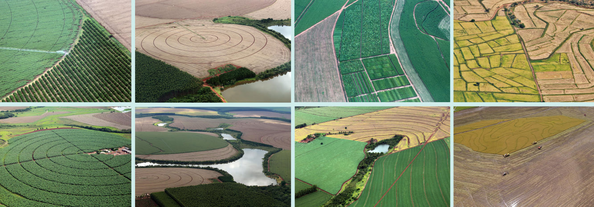

# Manual de execução dos scripts de processamento de dados, manipulação de GRIDS e execução de algoritmos de Machine Learning

Este manual visa apresentar os passos necessários para a execução dos scripts de processamento do mapeamento de áreas irrigadas
para diferentes culturas, criação dos grids devidamente tratados e aplicação do algoritmo de classificação Random Forest. 
